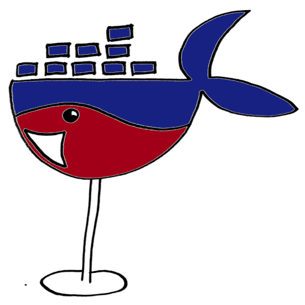
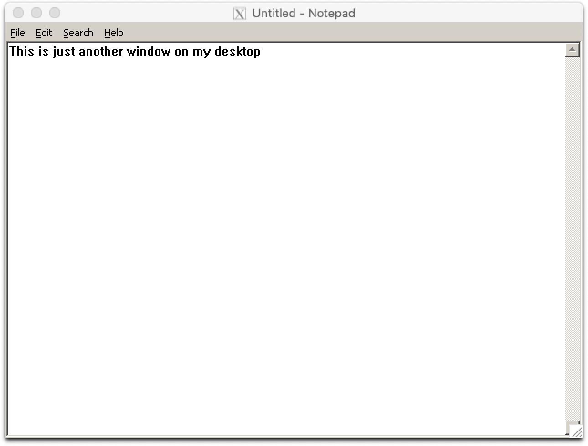
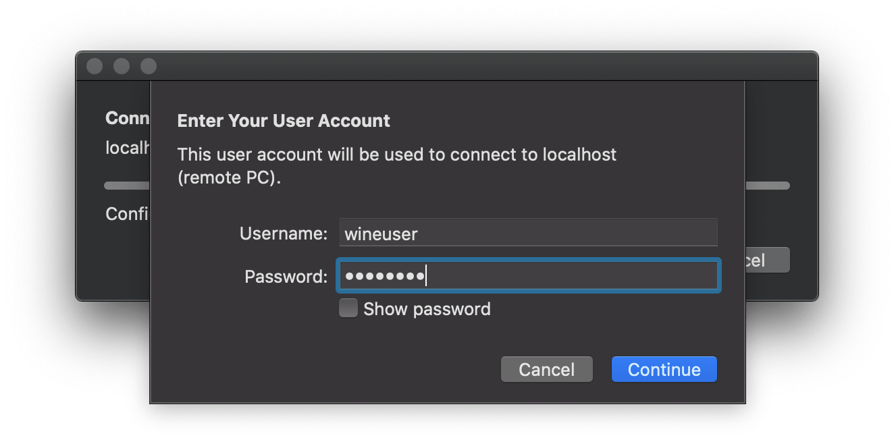
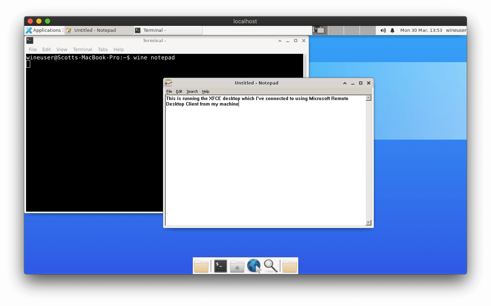

# docker-wine


[](https://github.com/scottyhardy/docker-wine/network)
[](https://github.com/scottyhardy/docker-wine/stargazers)



>Docker image that includes Wine and Winetricks for running Windows applications on Linux and macOS

The docker-wine container can either be run with X11 forwarding or as an RDP server to suit your use case.  The default is to use X11 forwarding which utilizes your machine's X server to render graphics directly into your current session and play sounds through pulseaudio (Linux only).

Using docker-wine with an RDP server allows the container to be run on a headless machine or a machine that may not be running an X server. You can then use a Remote Desktop client to connect to the container which may be located either on your local or a remote machine.  This is currently the only solution if you require sound on macOS.

---

## Getting Started

Using the `docker-wine` script is the easiest way to get started and should be all you need for Linux and macOS.

### Download the `docker-wine` script

On Linux:

```bash
wget https://raw.githubusercontent.com/scottyhardy/docker-wine/master/docker-wine -O docker-wine
chmod +x docker-wine
```

On macOS:

```bash
curl https://raw.githubusercontent.com/scottyhardy/docker-wine/master/docker-wine -o docker-wine
chmod +x docker-wine
```

## Run `docker-wine` with X11 forwarding

Running the script with no other arguments will start an interactive bash session:

```bash
./docker-wine
```

You can override the default interactive bash session by adding `wine`, `winetricks`, `winecfg` or any other valid commands with their associated arguments:

```bash
./docker-wine wine notepad
```



## Run `docker-wine` with RDP server

Run with the `--rdp=interactive` option to start the RDP server

```bash
./docker-wine --rdp=interactive
```

Or, you can run the container as a detached daemon that runs in the background.  To start the daemon:

```bash
./docker-wine --rdp=start
```

You can then stop the daemon:

```bash
./docker-wine --rdp=stop
```

## Connecting with an RDP client

All Windows desktops and servers come with Remote Desktop pre-installed and macOS users can download the Microsoft Remote Desktop application for free from the App Store.  For Linux users, I'd suggest using the Remmina Remote Desktop client.

For the hostname, use `localhost` if the container is hosted on the same machine you're running your Remote Desktop client on and for remote connections just use the name or IP address of the machine you are connecting to.
NOTE: To connect to a remote machine, it will require TCP port 3389 to be exposed through the firewall.

To log in, use the following default user account details:

```bash
Username: wineuser
Password: wineuser
```





## Additional options when running `docker-wine`

Run as root:

```bash
./docker-wine --run-as-root
```

You can attach as many additional volumes as you like, using standard docker syntax:

```bash
./docker-wine --volume="myvol:/some/path:ro" --volume="/tmp/test:/tmp/myscriptdir"
```

You can also combine options:

```bash
./docker-wine --run-as-root --volume="myvol:/some/path" --rdp=interactive
```

See the `docker-wine` help for a full list of options:

```bash
./docker-wine --help
```

## Build and run locally on your own computer

First, clone the repository from GitHub:

```bash
git clone https://github.com/scottyhardy/docker-wine.git

cd docker-wine
```

To build the container, simply run:

```bash
./build
```

To run the your locally built container, use `docker-run` with the `--local` switch:

```bash
./docker-run --local
```

## Volume container winehome

When the docker-wine image is instantiated with `docker-wine` script, the contents of the `/home/wineuser` folder is copied to the `winehome` volume container on instantiation of the `wine` container.

Using a volume container allows the `wine` container to remain unchanged and safely removed after every execution with `docker run --rm ...`.  Any user environments created with `docker-wine` will be stored separately and user data will persist as long as the `winehome` volume is not removed.  This effectively allows the `docker-wine` image to be swapped out for a newer version at anytime.

You can manually create the `winehome` volume container by running:

```bash
docker volume create winehome
```

If you don't want the volume container, you can delete it by using:

```bash
docker volume rm winehome
```

## Use docker-wine image in a Dockerfile

If you plan to use `scottyhardy/docker-wine` as a base for another Docker image, you should set up the same `ENTRYPOINT` to enable X11 forwarding and RDP server modes to continue operating:

```dockerfile
FROM scottyhardy/docker-wine:latest
... <your code here>
ENTRYPOINT ["/usr/bin/entrypoint"]
```

## Manually running with `docker run` commands

First, pull the latest image from DockerHub:


## Troubleshooting

To test video, try opening Notepad:

```bash
docker-wine wine notepad
```

To test sound, try using `pacat` just to confirm PulseAudio is working:

```bash
docker-wine pacat -vv /dev/random
```
