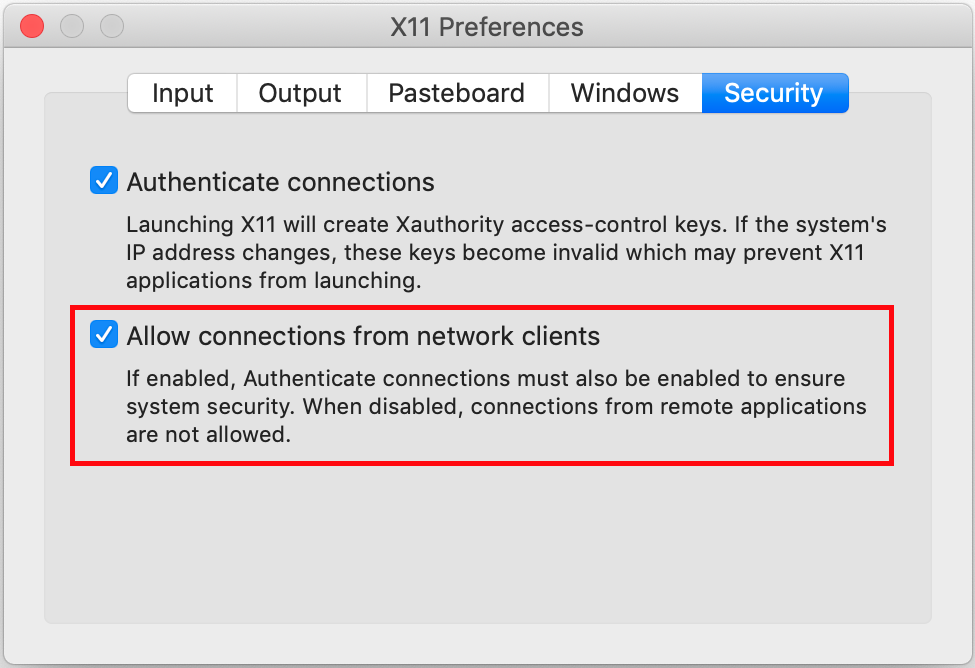

# docker-wine 


[](https://github.com/scottyhardy/docker-wine/network)
[](https://github.com/scottyhardy/docker-wine/stargazers)

* [About docker-wine](#about-docker-wine)
* [Running from Docker Hub image](#running-from-docker-hub-image)
  * [Create a Docker volume container for user data](#create-a-docker-volume-container-for-user-data)
  * [Run without sound](#run-without-sound)
  * [Run using PulseAudio for sound](#run-using-pulseaudio-for-sound)
  * [Run on macOS](#run-on-macos)
* [Build and run locally on your PC](#build-and-run-locally-on-your-pc)
* [Running the docker-wine script](#running-the-docker-wine-script)
* [Volume container winehome](#volume-container-winehome)
* [ENTRYPOINT script explained](#entrypoint-script-explained)
* [Using docker-wine in your own Dockerfile](#using-docker-wine-in-your-own-dockerfile)

## About docker-wine

The `docker-wine` image was created so I could experiment with [Wine](https://www.winehq.org) while learning the ropes for using Docker containers. The image is based on Ubuntu 18.04 and includes Wine version 4.0 ([stable branch](https://wiki.winehq.org/Wine_User%27s_Guide#Wine_from_WineHQ)) and the latest version of [Winetricks](https://wiki.winehq.org/Winetricks) to help manage your Wine bottles.

Included below are instructions for running the `docker-wine` container that allows you to use the Docker host's X11 session to display graphics and its PulseAudio server for sound through the use of UNIX sockets.

The source code is freely available from the [scottyhardy/docker-wine GitHub repository](https://github.com/scottyhardy/docker-wine) for you to build the image yourself and contributions are welcome.

## Running from Docker Hub image

### Create a Docker volume container for user data

Create a volume container so user data is kept separate and can persist after the `docker-wine` container is removed:

```bash
docker volume create winehome
```

Please note: It is not recommended to use your own home folder for storing data as it will change ownership to `wineuser`, which has a UID and GID of `1010`.

### Run without sound

The recommended commands for running `docker-wine` are:

```bash
docker run -it \
    --rm \
    --env="DISPLAY" \
    --volume="${XAUTHORITY}:/root/.Xauthority:ro" \
    --volume="winehome:/home/wineuser" \
    --net="host" \
    --name="wine" \
    scottyhardy/docker-wine <Additional arguments e.g. wine notepad.exe>
```

This assumes the `$XAUTHORITY` environment variable is set to the location of the MIT magic cookie.  If not set, the default location is in the user's home so you can replace `${XAUTHORITY}` with `${HOME}/.Xauthority`. This file is required to allow the container to write to the current user's X session. For this to work you also need to include the `--net=host` argument when executing `docker run` to use the host's network stack which includes the X11 socket.

### Run using PulseAudio for sound

As a one-off, you will need to create the file `.config/pulse/default.pa` in your home folder, to enable you to create a shared UNIX socket `/tmp/pulse-socket` to allow other users on the same host to access the user's PulseAudio server:

```bash
mkdir -p "${HOME}/.config/pulse"
echo -e ".include /etc/pulse/default.pa\nload-module module-native-protocol-unix auth-anonymous=1 socket=/tmp/pulse-socket" > ${HOME}/.config/pulse/default.pa
```

Restart your PulseAudio server to create the new socket:

```bash
pulseaudio -k
pulseaudio --start
```

Now you're ready to run the container using PulseAudio for sound:

```bash
docker run -it \
    --rm \
    --env="DISPLAY" \
    --volume="${XAUTHORITY}:/root/.Xauthority:ro" \
    --volume="/tmp/pulse-socket:/tmp/pulse-socket" \
    --volume="winehome:/home/wineuser" \
    --net="host" \
    --name="wine" \
    scottyhardy/docker-wine <Additional arguments e.g. winetricks vlc>
```

### Run on macOS

Unfortunately there's a lot of additional barriers when attempting to run containers on macOS.  At time of writing, it is not possible to directly mount UNIX sockets like you can do in Linux. There's a few different ways this problem can be solved, but essentially it comes down to using TCP sockets or a remote desktop protocol such as VNC.

Below are instructions for using TCP sockets on macOS but unfortunately performance is way slower than with UNIX sockets on Linux, plus I haven't managed to get audio working yet. If you're serious about using a Windows application on macOS then this is probably not the best solution. If you'd just like to give it a go for shits and giggles, then this should be enough to get you started.

Install homebrew:

```bash
ruby -e "$(curl -fsSL https://raw.githubusercontent.com/Homebrew/install/master/install)"
```

Install XQuartz:

```bash
brew install xquartz
```

Start XQuartz:

```bash
open -a xquartz
```

Enable network clients in XQuartz Preferences:

Go to **XQuartz** -> **Preferences...**

Or use shortcut keys: **&#8984;,**

On the **Security** tab, tick the option **Allow connections from network clients**



**IMPORTANT! Restart XQuartz:**

Go to **XQuartz** -> **Quit X11**

Or use shortcut keys: **&#8984;Q**

*Note: If graphics are not working and you get errors that X11 is not available it's probably because you missed this step.*

Run container with docker-wine script:

This is the easiest way to ensure `docker-wine` runs successfully each time.  Just jump ahead to LINK and continue from there.

Otherwise, if you prefer to run the container manually, then continue reading.

Allow localhost to access XQuartz:

```bash
xhost + 127.0.0.1
```

Start container:

```bash
docker run -it \
    --rm \
    --env="DISPLAY=host.docker.internal:0" \
    --volume="winehome:/home/wineuser" \
    --hostname="winery" \
    --name="wine" \
    scottyhardy/docker-wine <Additional arguments e.g. winetricks vlc>
```

## Build and run locally on your PC

First, clone the repository from GitHub:

```bash
git clone https://github.com/scottyhardy/docker-wine.git
```

To build the container, simply run:

```bash
make
```

To run the container and start an interactive session with `/bin/bash` run either:

```bash
make run
```

or use the `docker-wine` script as described below.

## Running the docker-wine script

When the container is run with the `docker-wine` script, you can override the default interactive bash session by adding `wine`, `winetricks`, `winecfg` or any other valid commands with their associated arguments:

```bash
./docker-wine wine notepad.exe
```

```bash
./docker-wine winecfg
```

```bash
./docker-wine winetricks msxml3 dotnet40 win7
```

## Volume container winehome

When the docker-wine image is instantiated with `./docker-wine` script or with the recommended `docker volume create` and `docker run` commands, the contents of the `/home/wineuser` folder is copied to the `winehome` volume container on instantiation of the `wine` container.

Using a volume container allows the `wine` container to remain unchanged and safely removed after every execution with `docker run --rm ...`.  Any user environments created with `docker-wine` will be stored separately and user data will persist as long as the `winehome` volume is not removed.  This effectively allows the `docker-wine` image to be swapped out for a newer version at anytime.

You can manually create the `winehome` volume container by running:

```bash
docker volume create winehome
```

If you don't want the volume container to persist after running `./docker-wine`, just add `--rm` as your first argument.
e.g.

```bash
./docker-wine --rm wine notepad.exe
```

Alternatively you can manually delete the volume container by using:

```bash
docker volume rm winehome
```

## ENTRYPOINT script explained

The `ENTRYPOINT` set for the docker-wine image is simply `/usr/bin/entrypoint`. This script is key to ensuring the user's `.Xauthority` file is copied from `/root/.Xauthority` to `/home/wineuser/.Xauthority` and ownership of the file is set to `wineuser` each time the container is instantiated.

Arguments specified after `./docker-wine` or after the `docker run ... docker-wine` command are also passed to this script to ensure it is executed as `wineuser`.

For example:

```bash
./docker-wine wine notepad.exe
```

The arguments `wine notepad.exe` are interpreted by the `wine` container to override the `CMD` directive, which otherwise simply runs `/bin/bash` to give you an interactive bash session as `wineuser` within the container.

## Using docker-wine in your own Dockerfile

If you plan to use `scottyhardy/docker-wine` as a base for another Docker image, you should set up the same entrypoint to ensure you run as `wineuser` and X11 graphics continue to function by adding the following to your `Dockerfile`:

```dockerfile
FROM scottyhardy/docker-wine:latest
... <your code here>
ENTRYPOINT ["/usr/bin/entrypoint"]
```

Or if you prefer to run a program by default you could use:

```dockerfile
ENTRYPOINT ["/usr/bin/entrypoint", "wine", "notepad.exe"]
```

Or if you want to be able to run a program by default but still be able to override it easily you could use:

```dockerfile
ENTRYPOINT ["/usr/bin/entrypoint"]
CMD ["wine", "notepad.exe"]
```
